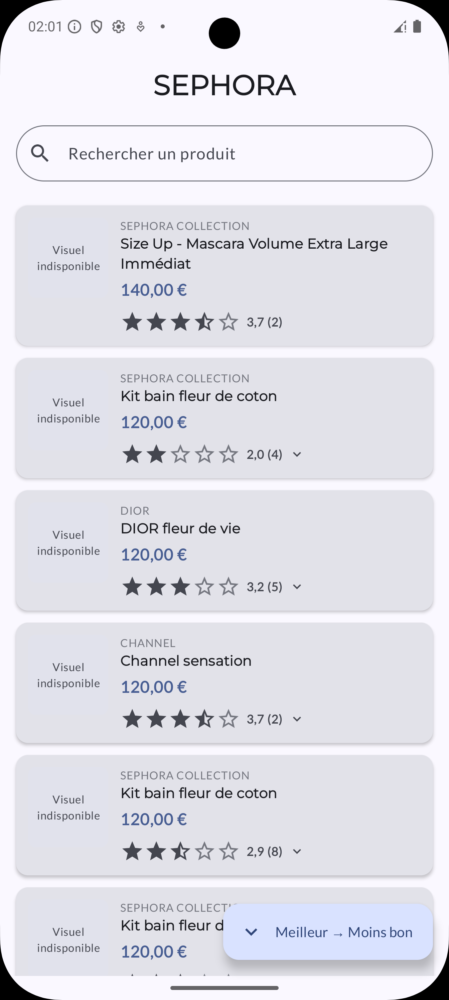
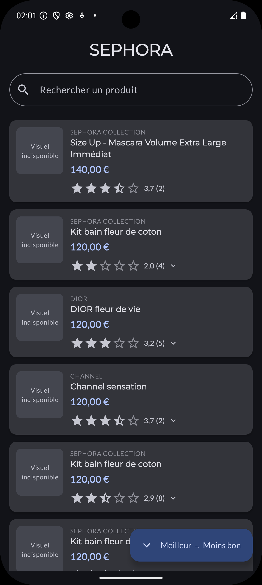
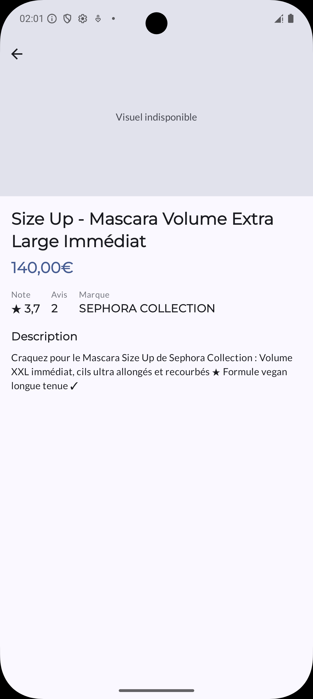
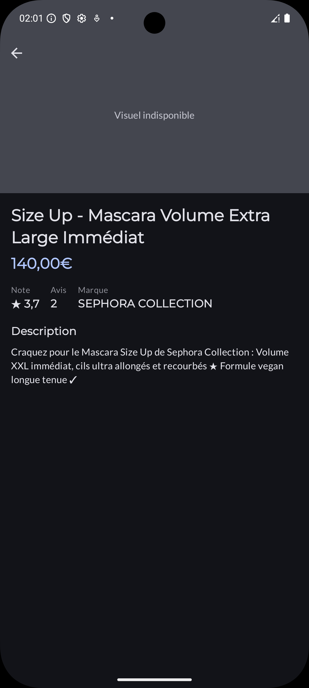

# Sephora Android App

A modern Android application for browsing Sephora products, built with **Clean Architecture**, **MVVM**, and a **multi-module structure** using current Android best practices.

## Screenshots

| Home — Light | Home — Dark |
|---|---|
|  |  |

| Detail — Light | Detail — Dark |
|---|---|
|  |  |

## Architecture

The app follows **Clean Architecture** :

```
┌─────────────────────────────────────────────────────────┐
│                  Presentation Layer                     │
│         Jetpack Compose · ViewModels · StateFlow        │
│       (features:home, features:detail-product)          │
└───────────────────────────┬─────────────────────────────┘
                            │
┌───────────────────────────▼─────────────────────────────┐
│                    Domain Layer                         │
│        Use Cases · Entities · Repository Interfaces     │
│                    (module: domain)                     │
└───────────────────────────┬─────────────────────────────┘
                            │
┌───────────────────────────▼─────────────────────────────┐
│                     Data Layer                          │
│    Repository Impl · Remote (Retrofit) · Local (Room)   │
│                     (module: data)                      │
└─────────────────────────────────────────────────────────┘
```

## Project Structure

```
Sephora/
├── app/
│   └── src/main/
│       ├── kotlin/com/aventique/sephora/
│       │   ├── di/AppModule.kt
│       │   ├── navigation/SephoraNavHost.kt
│       │   ├── MainActivity.kt
│       │   └── SephoraApplication.kt
│       └── java/com/aventique/sephora/
│           └── ui/theme/             # Color.kt · Theme.kt · Type.kt
│
├── domain/
│   └── src/main/kotlin/com/aventique/sephora/domain/
│       ├── common/
│       │   ├── DataResult.kt         # Sealed class: Success / Failure
│       │   ├── SortOrder.kt          # BEST_TO_WORST / WORST_TO_BEST
│       │   └── ErrorType.kt
│       ├── model/
│       │   ├── Product.kt
│       │   └── Review.kt
│       ├── repository/
│       │   └── ProductRepository.kt
│       └── usecase/
│           ├── GetAllProductsUseCase.kt
│           └── GetProductByIdUseCase.kt
│
├── data/
│   └── src/main/kotlin/com/aventique/sephora/data/
│       ├── common/
│       │   └── SafeCall.kt
│       ├── local/
│       │   ├── database/
│       │   │   ├── dao/ProductDao.kt
│       │   │   ├── entity/
│       │   │   │   ├── ProductEntity.kt
│       │   │   │   ├── ProductWithReviews.kt
│       │   │   │   └── ReviewEntity.kt
│       │   │   └── SephoraDatabase.kt
│       │   └── datasource/
│       │       └── ProductLocalDataSource.kt
│       ├── remote/
│       │   ├── datasource/
│       │   │   └── ProductRemoteDataSource.kt
│       │   └── network/
│       │       ├── dto/
│       │       │   ├── ProductDto.kt
│       │       │   └── ProductReviewsDto.kt
│       │       └── ProductsApi.kt
│       ├── mapper/ProductMapper.kt
│       └── repository/ProductRepositoryImpl.kt
│
└── features/
    ├── home/
    │   └── src/main/kotlin/com/aventique/sephora/features/home/
    │       ├── HomeNavigation.kt
    │       ├── HomeScreen.kt
    │       ├── HomeUiState.kt
    │       └── HomeViewModel.kt
    │
    └── detail-product/
        └── src/main/kotlin/com/aventique/sephora/features/detail/
            ├── DetailNavigation.kt
            ├── DetailScreen.kt
            ├── DetailUiState.kt
            └── DetailViewModel.kt
```

## Module Dependency Graph

```
app
├── domain
├── data          → domain
├── features:home → domain
└── features:detail-product → domain
```

## Tech Stack

| Category | Library | Version |
|---|---|---|
| Language | Kotlin | 2.0.21 |
| UI | Jetpack Compose + Material 3 | BOM 2024.09.00 |
| Navigation | Navigation Compose | 2.8.7 |
| DI | Koin | 3.5.0 |
| Networking | Retrofit + OkHttp | 2.11.0 / 4.12.0 |
| Serialization | Kotlinx Serialization JSON | 1.7.1 |
| Database | Room | 2.6.1 |
| Image Loading | Coil Compose | 2.4.0 |
| Async | Coroutines + Flow | 1.8.1 |
| Testing | JUnit + Mockito + Espresso | — |

**Build config:** Min SDK 26 · Target/Compile SDK 36 · Java 17

## Key Features

- **Product list** — lazy-loaded list with search bar and sort toggle (best/worst rating)
- **Review expansion** — tap rating stars to inline-expand/collapse reviews per product
- **Product detail** — full-screen view with image, brand, description, rating, and review count
- **Offline-first** — fetches from remote API, caches to Room; falls back to local cache on failure
- **Error & loading states** — all screens handle loading, error (with retry), and empty states
